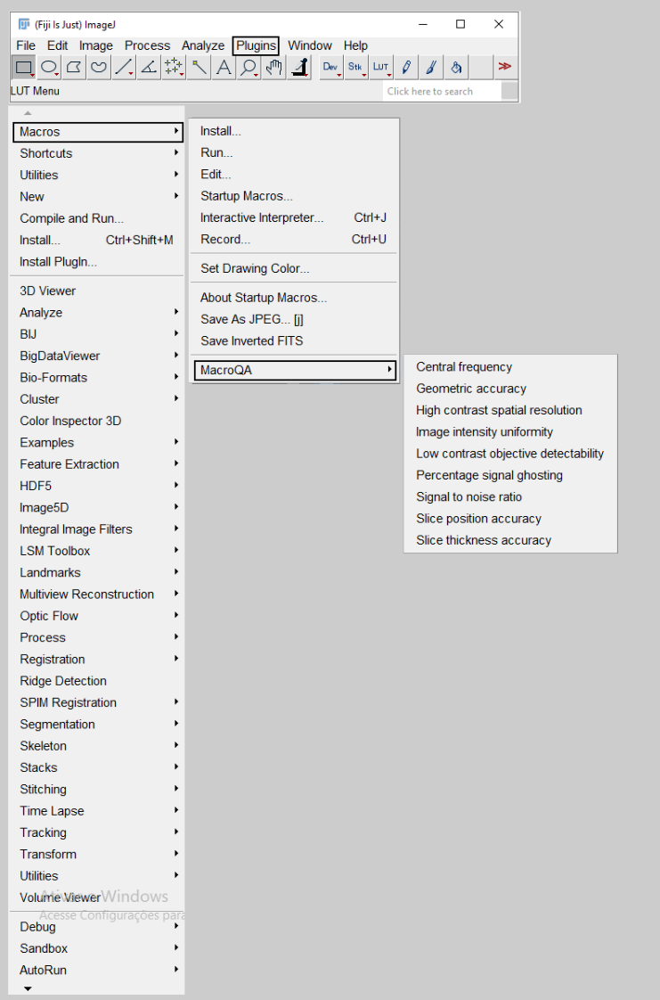

# MacroQA: An ImageJ Macro for ACR MRI Quality Assurance
`MacroQA` is a comprehensive ImageJ/Fiji macro designed to provide a more reliable and practical implementation of the American College of Radiology (ACR) Quality Assurance (QA) tests. Its development was motivated by academic and pedagogical needs, aiming to simplify the testing process for students, researchers, and MRI staff. By leveraging ImageJ/Fiji's built-in functions, MacroQA can perform all tests from the MRI ACR phantom manual with impressive accuracy and efficiency, completing the process in just a few minutes.

---

## Why MacroQA?
Most existing implementations for performing ACR QA tests rely on proprietary software, such as MATLAB, which requires a paid license and limits accessibility. This creates a significant barrier for researchers, educators, students and MRI staff in resource-constrained environments.\
In contrast, MacroQA is:
- **Free and open-source** - built entirely on Image/Fiji.
- **Accessible** - written in Jython, a Python-like (Python2) language already embedded in Fiji.
- **Transparent and reproducible** - the source code is openly available for inspection, validation, and further development.

---

## Tests included
MacroQA performs in a semi-automated way the following ACR phantom QA tests:
- **Central Frequency** – checks imaging frequency stability extracting the value from DICOM header.  
- **Geometric Accuracy** – verifies correct image scaling in all directions.  
- **High-contrast Spatial Resolution** – evaluates ability to resolve small objects.  
- **Slice Thickness Accuracy** – ensures prescribed slice thickness is achieved.  
- **Slice Position Accuracy** – confirms accurate slice prescription relative to the localizer.  
- **Image Intensity Uniformity** – measures uniformity of signal across the phantom.  
- **Percent-signal Ghosting** – quantifies ghosting artifacts.  
- **Low-contrast Object Detectability** – assesses visibility of low-contrast structures.  
- **Signal-to-noise Ratio (SNR)** – optional test for background noise evaluation.  

Each test follows the acceptance criteria defined in the **ACR MRI QA Program**.  

---

## Installation
1. Ensure that you have [Fiji](https://imagej.net/software/fiji/) installed, preferably with Java 8 runtime.
> [!NOTE]
> We recommend using the Fiji distribution because it already includes the Jython library.
2. Clone or download the `MacroQA` repository from this GitHub page.
> [!NOTE]
> This software is a self-contained ImageJ/Fiji macro and does not require any external dependencies beyond a standard installation of Fiji. It relies solely on the core functions of ImageJ and Jython.

---

## How to use MacroQA in Fiji?
MacroQA can be used in two main ways, depending on your preference:

### Method 1: Run directly via Macro Editor
This method is ideal for quick use or one-off tests.

**Steps (Fiji):**
1. Open the ***StartupMacros*** in the *Plugins > Macros* tab.
2. In your file explorer, locate the `MacroQA` folder.
3. Open the folder and double-click on the macro that you want to run.
4. The macro will open in Fiji's editor - simply press *Run*.

*For ImageJ/ImageJ2 users* the steps are similar, but ensure that the Jython library is also installed.*

---

### Method 2: Install as a Plugin
Installing `MacroQA` as a plugin integrates it into Fiji's menu system, making it persistently available across sessions.

**Steps (general):**
1. Copy the `MacroQA` folder into a subdirectory of your Fiji `plugins` folder (for example, `.../Fiji.app/plugins/` or `.../Fiji.app/plugins/Macros/`).
2. Restart Fiji.
3. The macros will now appear in the *Plugins > Macros* menu.

> [!TIP]
> **Platform-specific examples:**
- Windows (typical): `C:\Program Files\Fiji\Fiji.app\plugins\Macros\MacroQA`
- macOS (typical): `/Applications/Fiji.app/plugins/Macros/MacroQA` or `~/Fiji.app/plugins/Macros/MacroQA`
- Linux (typical): `/home/<user>/Fiji.app/plugins/Macros/MacroQA` or `/opt/Fiji.app/plugins/Macros/MacroQA`

---

## Usage example
Once installed, MacroQA becomes available under the Plugins > Macros menu in Fiji (Figure 1). From there, the user can select any of the available ACR quality control tests, such as Central Frequency, Geometric Accuracy, or Signal-to-Noise Ratio.

<figcaption>Figure 1: Accessing QC tests from Macros menu in Fiji.<figcaption>

\
When a test is launched, MacroQA guides the user through the required steps via dialog boxes and messages. For example, running the Central Frequency test (Figure 2) prompts the user to select the appropriate image series and automatically reports the measured resonance frequency in the Fiji log window.

<figcaption>Figure 2: Example of Central Frequency test dialog.<figcaption>

\
Some tests require user interaction, such as drawing straight lines or selecting regions of interest. In the Geometric Accuracy test (Figures 3), the macro requests that the user load the Localizer image and draw reference lines across the phantom. These inputs are then used to calculate geometric dimensions, which are compared against the ACR acceptance criteria.

<figcaption>Figure 3: Example of procedure for the Geometric Accuracy test.

---

## Known notes & recommendations
- **Available data:** Data is available for testing, mind that the data format is *enhanced DICOM*, and ACR T2 series has two echo times.
- **Java / Jython**: MacroQA relies on Jython (Python 2). Ensure Fiji is running with a Java runtime that supports Jython (Java 8 is recommended).  
- **Enhanced/multi-frame DICOMs**: The macros attempt to handle the following cases: *enhanced DICOMs, multi-frame DICOMs and single-frame DICOMs*, but for enhanced DICOM follows proprietary Philips ordering formats.
- **ACR manual guidelines:** Users are encouraged to first review and follow the [ACR MRI Phantom testing guidelines](https://accreditationsupport.acr.org/helpdesk/attachments/11093487417) when using MacroQA for the first time. This ensures familiarity with the procedures and acceptance criteria before relying on automated analysis.

---

## Contributing
Contributions are welcome. Please open issues for bugs or feature requests. Pull requests should include a short description and, when appropriate, test data.

---

