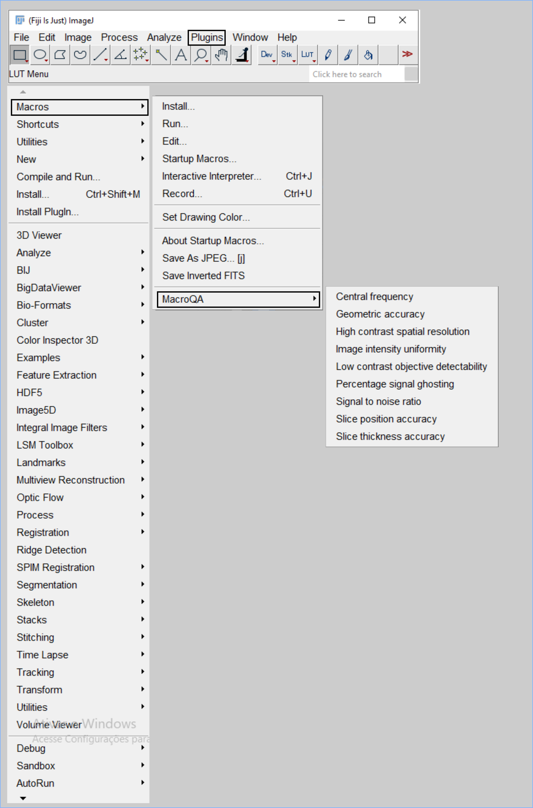
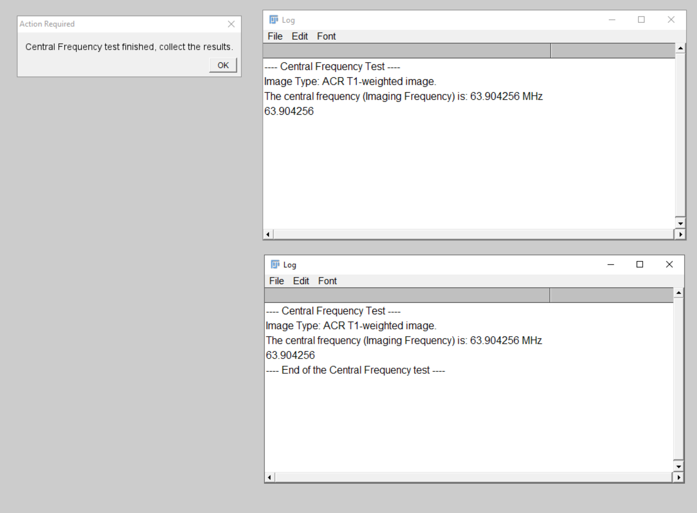
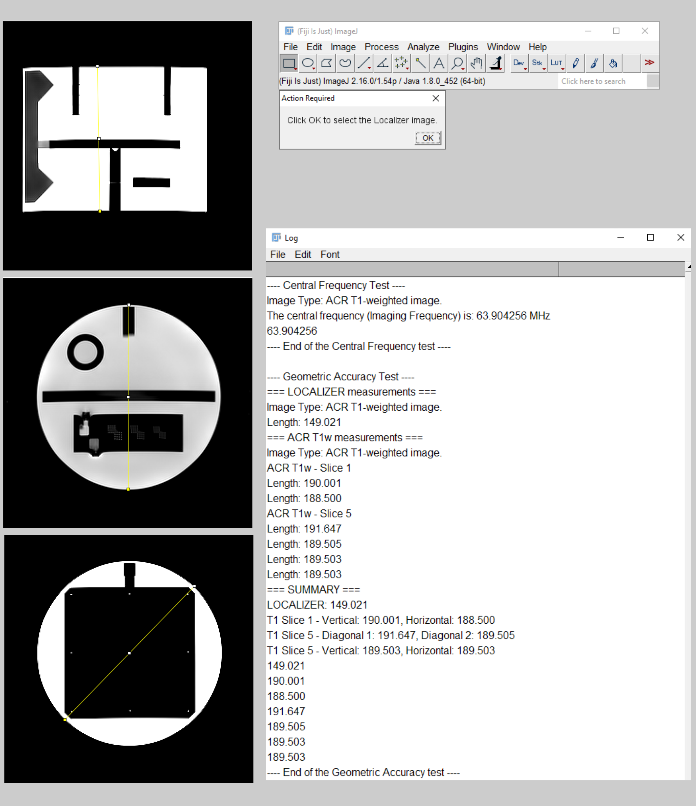

# Summary
MacroQA is an open-source ImageJ/Fiji macro package that implements the American College of Radiology (ACR) quality assurance (QA) tests for MRI phantoms. The project was developed with academic and pedagogical goals in mind, and it aims to simplify and standardize phantom testing. By leveraging Fiji/ImageJ's built-in functionality, MacroQA performs the ACR phantom tests quickly and reproducibly, completing the QA workflow within minutes. As a free and accessible alternative to proprietary software, MacroQA lowers barriers to adoption, promotes reproducibility, and supports collaborative development in the MRI research and clinical communities.

# Statement of need
Magnetic resonance imaging (MRI) is one of the most powerful diagnostic and research tools in medicine. From a neuroimaging perspective, MRI enables the study of brain anatomy, function, connectivity (both functional and structural), and metabolism. Its diversity and broad applicability have made MRI indispensable in modern medicine and neuroscience [@dumoulin_ultra-high_2018; @granziera_quantitative_2021; @ruber_mri_2018; @macdonald_cerebrovascular_2015].
To ensure reliable scanner performance, quality assurance (QA) programs and quality control (QC) tests are essential: they monitor stability and detect deviations in parameters that affect image quality [@epistatou_automated_2020; @vogelbacher_labqa2go_2019]. The most widely adopted program is that of the American College of Radiology (ACR), which uses a standardized accreditation phantom.
Reproducibility is a central concern in the MRI community. QA/QC procedures quantify experimental stability, identify outliers, reduce variability in outcome measures, and strengthen the reliability of both research findings and clinical diagnoses [@stocker_reproducibility_2025].
Many existing implementations of ACR QA tests rely on proprietary platforms such as MATLAB [@sun_open_2015]. These require paid licenses and limit accessibility, creating barriers for facilities that lack commercial software.
MacroQA addresses this gap by providing an open-source implementation of ACR QA tests within Fiji/ImageJ using the Jython scripting language. This design removes financial barriers while promoting transparency and reproducibility. By making the code openly available, MacroQA offers a cost-effective, shareable, and verifiable solution for MRI phantom QA that supports both clinical practice and reproducible research.

# Installation
1. Ensure that you have [Fiji](https://imagej.net/software/fiji/) installed, preferably with Java 8 runtime.
*Note: We recommend using the Fiji distribution because it already includes the Jython library.*
2. Clone or download the `MacroQA` repository from this GitHub page.
*Note: This software is a self-contained ImageJ/Fiji macro and does not require any external dependencies beyond a standard installation of Fiji. It relies solely on the core functions of ImageJ and Jython.*

## How to use MacroQA in Fiji?
MacroQA can be used in two main ways, depending on your preference:

### Method 1: Run directly via Macro Editor
This method is ideal for quick use or one-off tests.

**Steps (Fiji):**
1. Open the ***StartupMacros*** in the *Plugins > Macros* tab.
2. In your file explorer, locate the `MacroQA` folder.
3. Open the folder and double-click on the macro that you want to run.
4. The macro will open in Fiji's editor - simply press *Run*.

*For ImageJ/ImageJ2 users* the steps are similar, but ensure that the Jython library is also installed.*

### Method 2: Install as a Plugin
Installing `MacroQA` as a plugin integrates it into Fiji's menu system, making it persistently available across sessions.

**Steps (general):**
1. Copy the `MacroQA` folder into a subdirectory of your Fiji `plugins` folder (for example, `.../Fiji.app/plugins/` or `.../Fiji.app/plugins/Macros/`).
2. Restart Fiji.
3. The macros will now appear in the *Plugins > Macros* menu.

**Platform-specific examples:**
- Windows (typical): `C:\Program Files\Fiji\Fiji.app\plugins\Macros\MacroQA`
- macOS (typical): `/Applications/Fiji.app/plugins/Macros/MacroQA` or `~/Fiji.app/plugins/Macros/MacroQA`
- Linux (typical): `/home/<user>/Fiji.app/plugins/Macros/MacroQA` or `/opt/Fiji.app/plugins/Macros/MacroQA`

# Functionality

## Usage example
Once installed, MacroQA becomes available under the Plugins > Macros menu in Fiji (Figure 1). From there, the user can select any of the available ACR quality control tests, such as Central Frequency, Geometric Accuracy, or Signal-to-Noise Ratio.
{ width=60% }
When a test is launched, MacroQA guides the user through the required steps via dialog boxes and messages. For example, running the Central Frequency test (Figure 2) prompts the user to select the appropriate image series and automatically reports the measured resonance frequency in the Fiji log window.
{ width=60% }
Some tests require user interaction, such as drawing straight lines or selecting regions of interest. In the Geometric Accuracy test (Figures 3), the macro requests that the user load the Localizer image and draw reference lines across the phantom. It then requests that the user load the ACR T1 series, where two different slices are assessed. These inputs are then used to calculate geometric dimensions, which are compared against the ACR acceptance criteria.
{ width=60% }

This combination of guided prompts and automated calculations ensures that even users with limited prior experience can reliably perform ACR phantom quality control tests in a reproducible manner.

## Quality control tests and their acceptance criteria

### Required images
For both large and medium phantoms, a minimum of three acquisitions are required: the **Localizer**, **ACR T1 series**, and the **ACR T2 series**.
- **Localizer:** a single-slice sagittal spin-echo acquired at the phantom's center.
- **ACR T1:** an 11-slice axial T1-weighted (T1w) series.
- **ACR T2:** an 11-slice axial T2-weighted (T2w) series acquired with two echo times; the longer echo is used as the T2-weighted image.

Below is a brief summary of the quality control tests supported by MacroQA. 
Users are encouraged to first review and follow the [ACR MRI Phantom testing guidelines](https://accreditationsupport.acr.org/helpdesk/attachments/11093487417) when using MacroQA for the first time. This ensures familiarity with the procedures and acceptance criteria before relying on automated analysis.

### Central frequency

**Objective:** Ensure the scanner operates at the correct resonance frequency. Off-resonance operation reduces signal-to-noise ratio (SNR) and may indicate drift in the static magnetic field.

**Frequency:** weekly

**Acceptance criteria:** within 1 ppm per day for superconducting magnets

**Image type:** ACR T1-weighted (T1w)

### Geometric accuracy

**Objective:** Verify that image scaling reflects the true dimensions of the imaged object.

**Frequency:** weekly

**Acceptance criteria:** ±3 mm (large phantom) and ±2 mm (medium phantom)

**Image type:** ACR T1-weighted (T1w)

### High-contrast spatial resolution

**Objective:** Assess the scanner's ability to resolve small objects.

**Frequency:** weekly

**Acceptance criteria:** visualization of the 1 mm holes

**Image type:** ACR T1-weighted (T1w) and T2-weighted (T2w)

### Slice thickness accuracy

**Objective:** Verify that the prescribed slice thickness matches the acquired slice.

**Frequency:** annual

**Acceptance criteria:** ±0.75 mm

**Image type:** ACR T1-weighted (T1w) and T2-weighted (T2w)

### Slice position accuracy

**Objective:** Assess the accuracy of slice positioning using the localizer image as a reference.

**Frequency:** annual

**Acceptance criteria:** ≤5 mm in both directions

**Image type:** ACR T1-weighted (T1w) and T2-weighted (T2w)

### Image intensity uniformity

**Objective:** Measure intensity uniformity over a large water-only region of the phantom near the middle of the imaged volume (typically near the head coil center).

**Frequency:** annual

**Acceptance criteria:** for scanners at 3T: PIU ≥ 80; for scanners < 3T: PIU ≥ 85

**Image type:** ACR T1-weighted (T1w) and T2-weighted (T2w)

### Percent-signal ghosting

**Objective:** Quantify ghosting artifacts in ACR images.

**Frequency:** annual

**Acceptance criteria:** ≤ 3%

**Image type:** ACR T1-weighted (T1w) and T2-weighted (T2w)

### Low-contrast object detectability

**Objective:** Determine the extent to which low-contrast objects are discernible in the images.

**Frequency:** weekly

**Acceptance criteria:** for scanners at 3T: ≥37 spokes (ACR T1 and T2). For scanners between 1.5T and <3T: ≥30 spokes (ACR T1) and ≥25 spokes (ACR T2).

**Image type:** ACR T1-weighted (T1w) and T2-weighted (T2w)

### Signal-to-noise ratio (SNR)

**Objective:** Measure the ratio of true signal to background noise. Although SNR is not always explicitly included in the ACR manual, it is a key indicator of image quality.

**Frequency:** weekly

**Acceptance criteria:** not formally specified by the ACR

**Image type:** ACR T1-weighted (T1w) — note: SNR may require additional acquisitions or specific measurement regions

## Software description

MacroQA is implemented in Jython (www.jython.org), the Python implementation for the Java platform, and runs within Fiji/ImageJ. Fiji was chosen because it is widely used, free, and cross-platform. Each QC test is implemented as an independent macro, which simplifies development and installation. After installation, the macros appear in Fiji's menu under a dedicated "MacroQA" submenu.

- **Inputs:** DICOM images acquired with the ACR accreditation phantom.
- **Outputs:** numerical results displayed in the Fiji log window and optionally saved to disk.

MacroQA is distributed under the GNU General Public License v3.0 (GPL-3.0), which ensures the code remains free to use, modify, and redistribute under the license terms.

## Availability
MacroQA is publicly available on [GitHub](https://github.com/icaroafoliveira/Macros_MRI_QA_phantom_ACR). The tool is distributed under the GNU General Public License v3.0 (GPL-3.0). Installation and usage instructions are provided in the repository README. We welcome contributions and feedback from the community — please open an issue to report bugs or request features; pull requests are also welcome.

## Acknowledgements
GBV, VHCG, PHTCO, and MSQ (students in the Medical Physics program at the University of São Paulo) contributed nearly equally to coding, software development, and manuscript preparation during their internship. IAFO conceived the idea for MacroQA, contributed to coding and writing, and provided supervision and mentorship throughout the students' internship at the MRI service of the Ribeirão Preto Medical School, University of São Paulo.

# References
